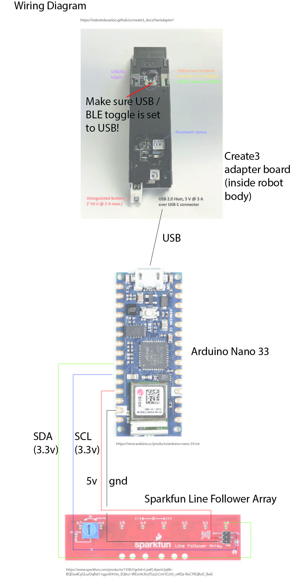

# Create3-LineFollower

This codebase enables the use of the Create3 with Sparkfun's Line Follower Array (SEN-13582). [This is the product](https://www.sparkfun.com/products/13582?gclid=CjwKCAjwnOipBhBQEiwACyGLurDqRxl11qgmK410x_EQ8u1-WEioHcXryTGz2cCml1E243_s4fQe-RoCYIIQAvD_BwE) we are using in this project.

We also used an [Arduino Nano IoT](https://store.arduino.cc/products/arduino-nano-33-iot), connected to the iRobot's USB port, but any device that uses 3.3v logic but offers a 5v power output should be sufficient. The line-follower array depends on 3.3v logic but requires 5v power.

## General control system:
1. The line-follower array sends data to the Arduino
1. The Arduino processes this and performs some data smoothing and analysis
1. The final position information is forwarded over USB serial to the Create3
1. The Create3 forwards this data over wifi/port without performing additional processing
1. An external CPU listens to data coming from this port
1. The external CPU processes the data and determines if the robot should turn, etc
1. The external CPU sends commands to the Create3 using ros2

## Limitations:
1. Currently the robot can only drive backwards, because of where the sensor is located (underneath the robot, behind the wheels), and this means that the ros2 scripts must override the safety system of the Create3 that limits backwards driving. We are interested in developing a forward-mounted sensor and may add this in the future.
1. Depending on the floor color, you will have better or worse outcomes. The line-follower array is extremely sensitive to contrast and lighting. We had better results using the sensor in "inverted" mode, where it detects a while line on a dark background. This seemed to be more versatile with different floor types
1. Floor smoothness affects accuracy of readings, since as the robot drives over bumps the line on the ground will vary in distance.
1. The Create3 has a minimum speed, and that is the speed we are specifying in our scripts.

## Ros2 Installation, Create3 setup, tutorials:
1. Refer to instructions in my other repository [here](https://github.com/gruedisueli/Create3-Grasshopper-Toolkit)

